# moxymind-qa-automation-showcase

Polished technical-task solution for API, frontend, and optional mobile automation.

## Submission Notes

- API and frontend automation are the main solution.
- Mobile Kotlin/Appium is an optional bonus and does not block the main delivery.
- Authenticated ReqRes tests require `REQRES_API_KEY`.
- Frontend tests run without an external secret.

## What Is Included

- Playwright test runner with HTML report
- ReqRes API client/helper
- data-driven API tests
- API positive and negative scenarios
- exact pagination assertions and a configurable POST response-time limit
- SauceDemo frontend tests
- Page Objects for frontend flows
- GitHub Actions split into API and frontend jobs
- documentation for strategy, cases, and limitations
- optional Kotlin/Appium mobile suite with native Android and iOS demo app sources

## Project Structure

```text
.
|-- .github/workflows/qa.yml
|-- docs/
|   |-- known-limitations.md
|   |-- test-cases.md
|   `-- test-strategy.md
|-- evidence/
|   |-- api/
|   `-- frontend/
|-- mobile/
|-- scripts/
|-- src/
|   |-- api/
|   |-- config/
|   |-- frontend/pages/
|   `-- test-data/
|-- tests/
|   |-- api/
|   `-- frontend/
|-- package-lock.json
|-- package.json
|-- playwright.config.ts
`-- tsconfig.json
```

## Requirements

- Node.js 22 or newer
- npm
- ReqRes API key for the full API suite

ReqRes key setup:

```bash
export REQRES_API_KEY=<your key>
```

PowerShell:

```powershell
$env:REQRES_API_KEY="<your key>"
```

Alternatively, create a local ignored `.env` file from the committed template:

```powershell
Copy-Item .env.example .env
```

Then set only the local value:

```text
REQRES_API_KEY=<your key>
```

Playwright and `npm run verify:reqres-env` load `.env` automatically. The file is covered by `.gitignore`; never put a real key in `.env.example`.

## Install

```bash
npm ci
npx playwright install chromium
```

## Run Tests

Run everything:

```bash
npm test
```

Run only API:

```bash
npm run test:api
```

Without `REQRES_API_KEY`, this runs the public negative ReqRes boundary and skips authenticated ReqRes tests. With `REQRES_API_KEY`, the full API suite runs.

Run only frontend:

```bash
npm run test:frontend
```

Open the Playwright report:

```bash
npm run report
```

## Evidence Gallery

Compact reviewer evidence is stored in `evidence/` and mobile app screenshot folders. These images are committed intentionally so the reviewer can inspect the delivered flows without generating reports first.

### API

| OpenAPI endpoints | API Playwright run |
| --- | --- |
| 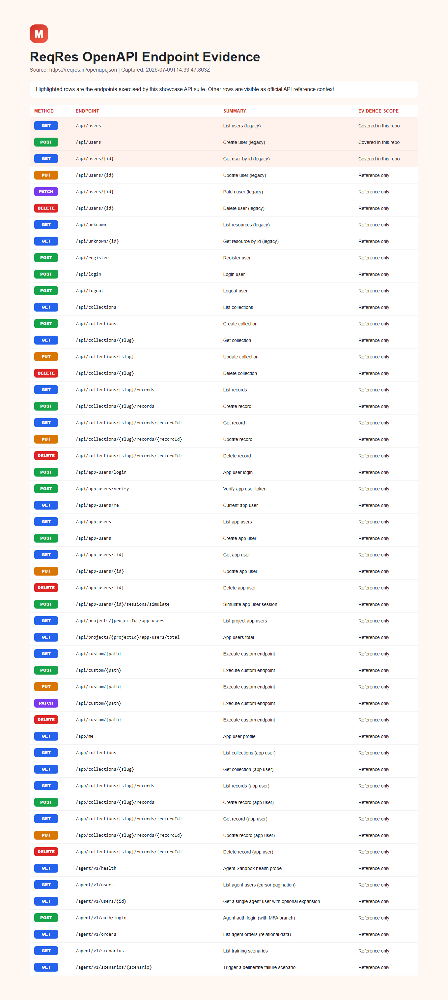 | 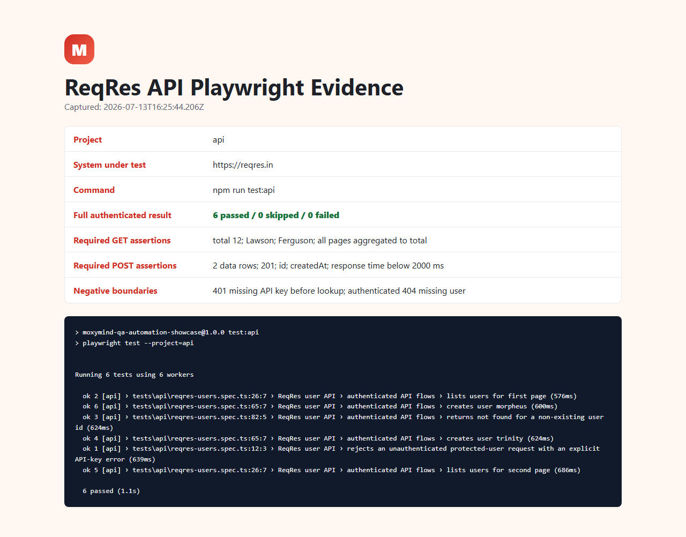 |

### Frontend

| Test run | Login |
| --- | --- |
| 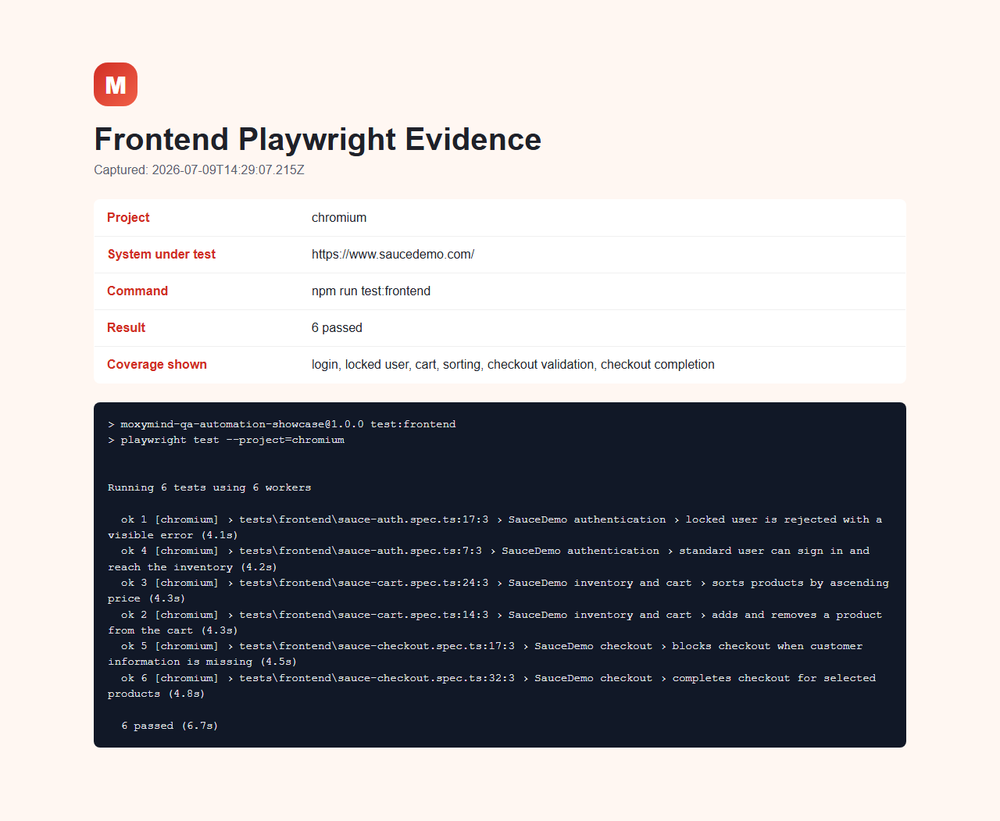 | 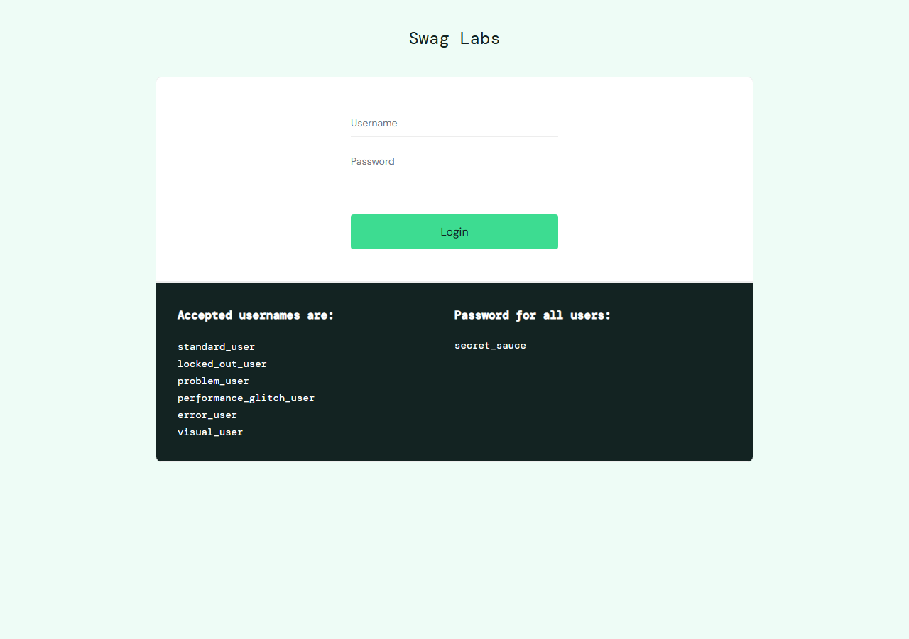 |

| Inventory | Cart |
| --- | --- |
| 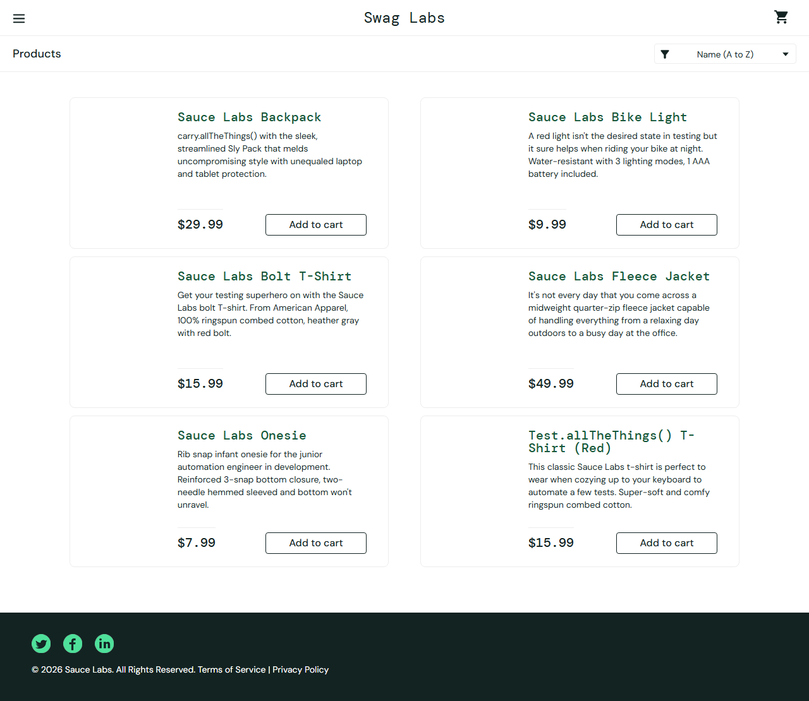 | 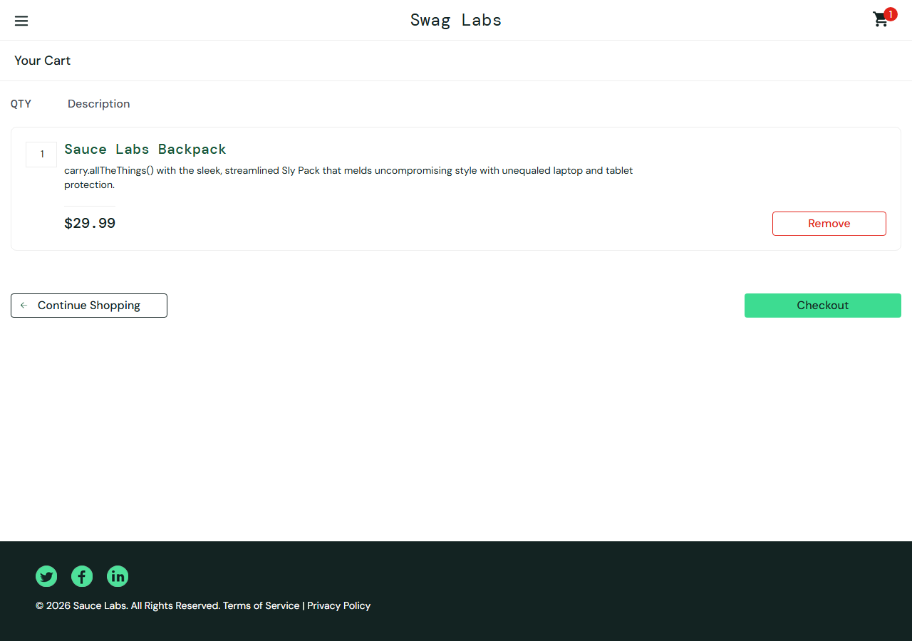 |

| Checkout complete | Locked user |
| --- | --- |
| 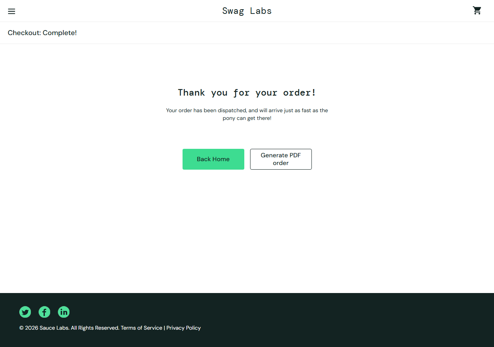 | 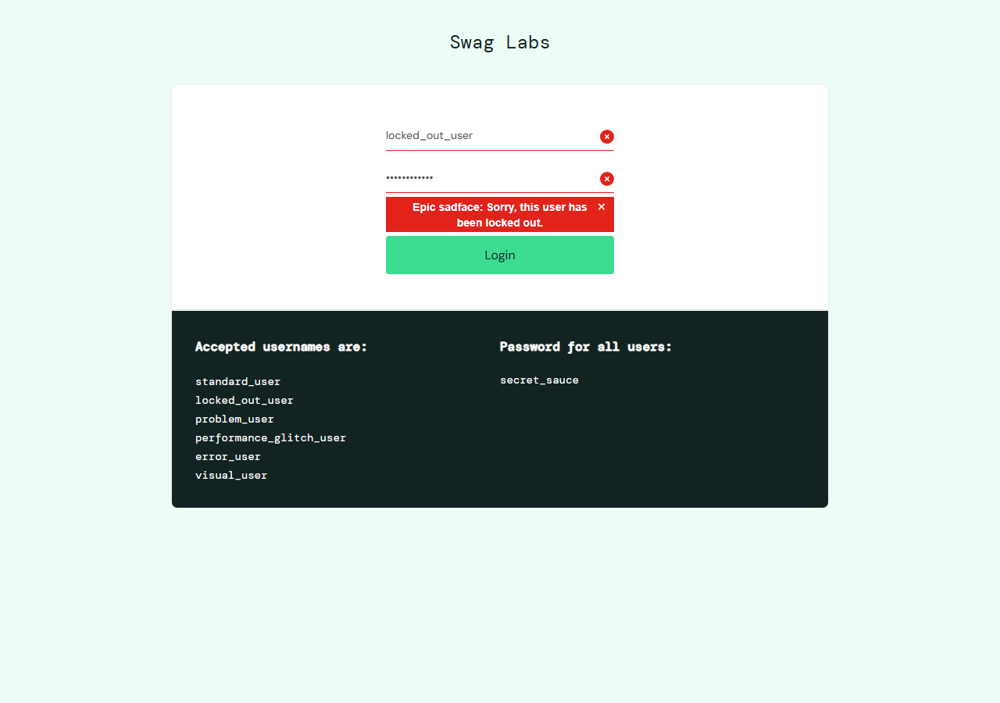 |

### Mobile Android

| Login | Invalid login |
| --- | --- |
| 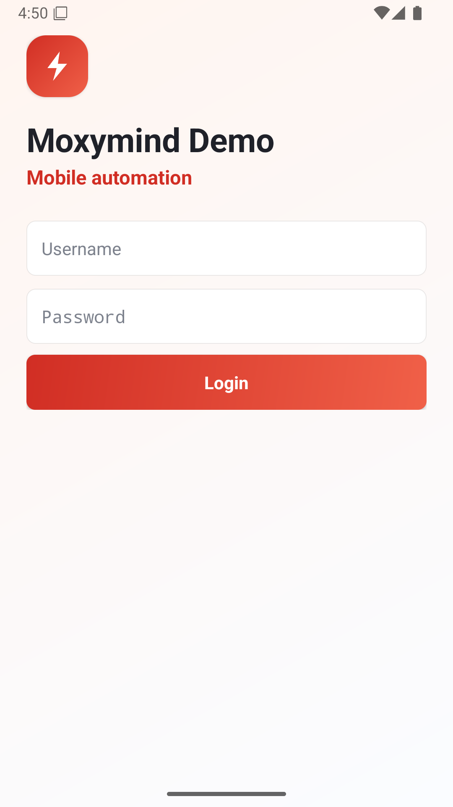 | 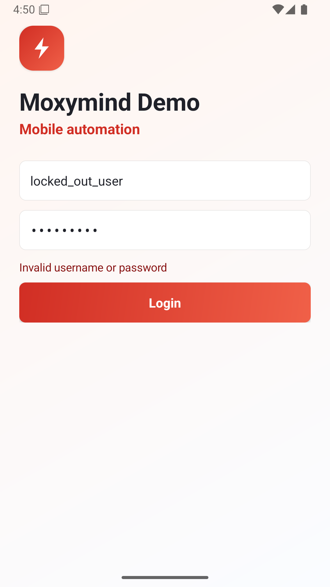 |

| Tasks | Mobile detail |
| --- | --- |
| 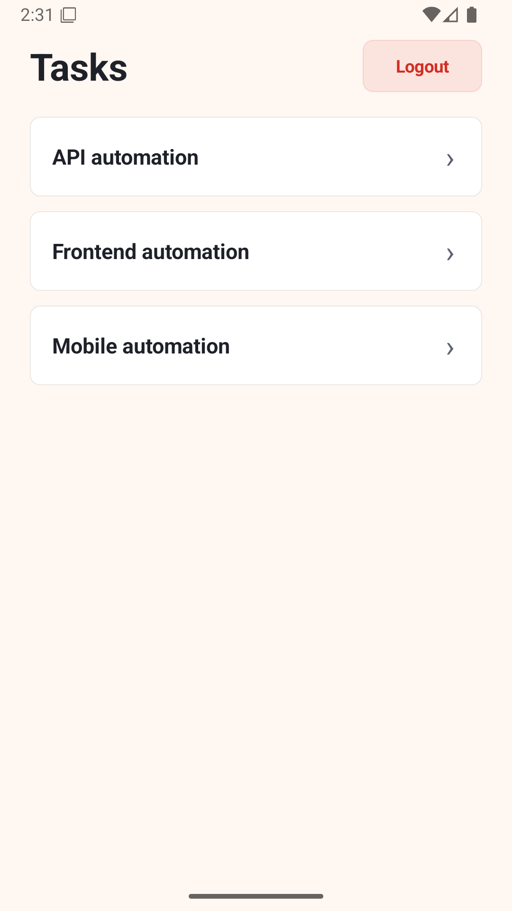 | 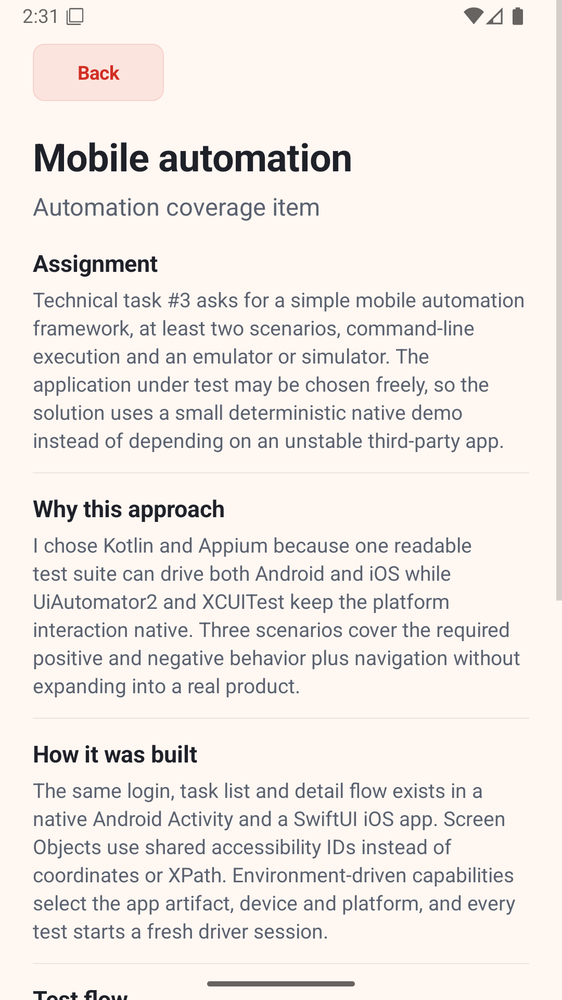 |

### Mobile iOS

| Login | Tasks |
| --- | --- |
|  |  |

| Invalid login | Mobile detail |
| --- | --- |
|  |  |

Generated folders such as `playwright-report/` and `test-results/` stay ignored to keep the repository small.

## Environment Variables

| Variable | Required | Default | Purpose |
| --- | --- | --- | --- |
| `REQRES_API_KEY` | Yes for full API suite | none | ReqRes `x-api-key` value |
| `REQRES_BASE_URL` | No | `https://reqres.in` | API base URL |
| `REQRES_ENV` | No | `prod` | ReqRes environment header |
| `API_RESPONSE_TIME_LIMIT_MS` | No | `2000` | Maximum accepted POST round-trip time in milliseconds |
| `SAUCEDEMO_BASE_URL` | No | `https://www.saucedemo.com` | Frontend base URL |
| `SAUCEDEMO_STANDARD_USER` | No | `standard_user` | Positive login user |
| `SAUCEDEMO_LOCKED_USER` | No | `locked_out_user` | Negative login user |
| `SAUCEDEMO_PASSWORD` | No | `secret_sauce` | SauceDemo password |

## CI

The workflow lives in `.github/workflows/qa.yml`.

Optional repository secret:

```text
REQRES_API_KEY
```

CI jobs:

- `api`: typecheck, run public API boundary, and run authenticated ReqRes tests only when `REQRES_API_KEY` exists
- `frontend`: install Chromium, run frontend suite

Both jobs upload Playwright artifacts.

## Mobile Bonus

Mobile automation is isolated under `mobile/`. It is intentionally optional and not part of the main CI gate. See `mobile/README.md`.

## Design Boundaries

This is not a dashboard, test platform, or custom framework. The useful structure is in clients, Page Objects, test data, docs, and CI separation.
