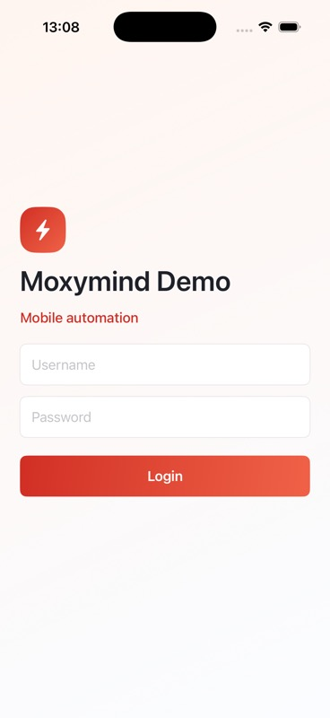
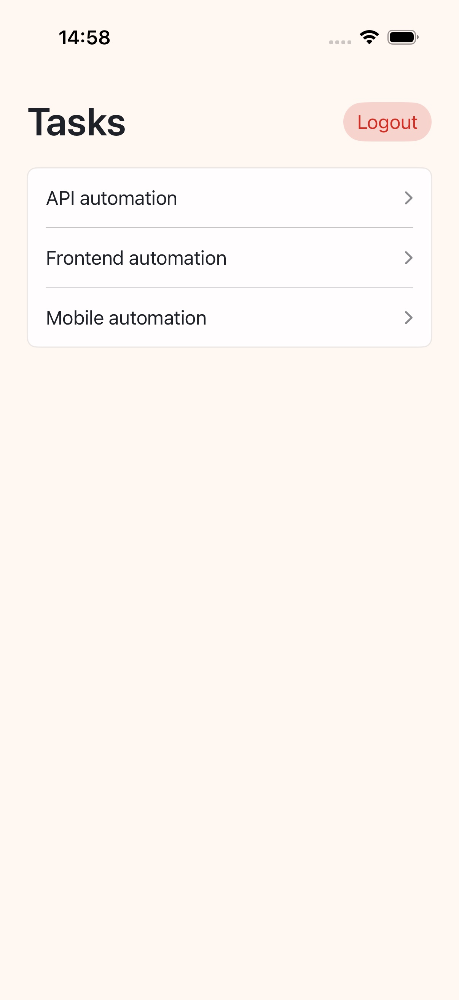
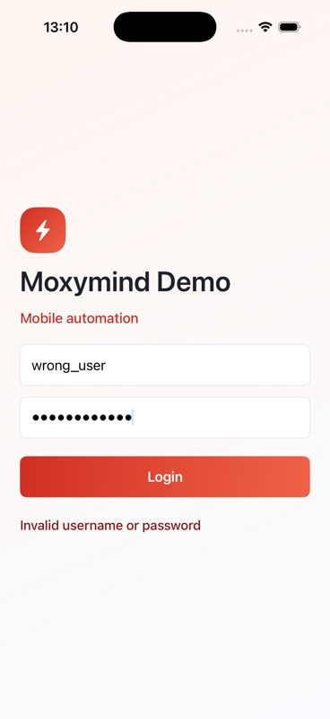
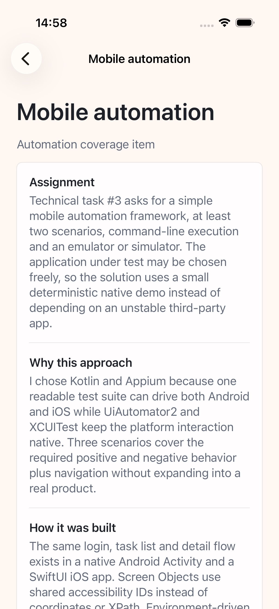

# MoxymindDemoApp iOS

Small native SwiftUI iOS app for deterministic mobile automation testing.

This app is the macOS/iOS counterpart to `mobile/android-demo-app`. Both apps expose the same user flow and automation identifiers so the Kotlin/Appium tests can target the same contract on different platforms.

## Contract

- App name: `MoxymindDemoApp`
- Bundle identifier: `com.example.MoxymindDemoApp`
- Target: iOS Simulator
- No network, backend, database, analytics, onboarding, permissions, Keychain, push notifications, camera, location, or biometrics.

## Automation Credentials

- Username: `qa_user`
- Password: `password123`

## Accessibility Identifiers

Login:

- `login.title`
- `login.username`
- `login.password`
- `login.submit`
- `login.error`

Tasks:

- `tasks.title`
- `tasks.row.api`
- `tasks.row.frontend`
- `tasks.row.mobile`
- `tasks.logout`

Task detail:

- `taskDetail.title`
- `taskDetail.description`

## Screenshots

These screenshots are captured from the iOS Simulator build.

| Login | Tasks |
| --- | --- |
|  |  |

| Invalid login | Mobile task detail |
| --- | --- |
|  |  |

## Build

Run from this folder on macOS:

```sh
xcodebuild \
  -project MoxymindDemoApp.xcodeproj \
  -scheme MoxymindDemoApp \
  -sdk iphonesimulator \
  -destination 'platform=iOS Simulator,name=iPhone 17,OS=latest' \
  -derivedDataPath build/DerivedData \
  CODE_SIGNING_ALLOWED=NO \
  build
```

Expected simulator app artifact:

```text
build/DerivedData/Build/Products/Debug-iphonesimulator/MoxymindDemoApp.app
```
